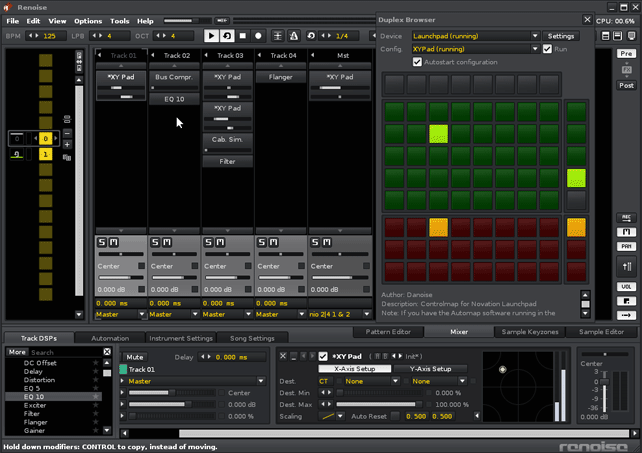

# Duplex.RoamingDSP

< Back to [Applications](../Applications.md)

## About

This class offers 'roaming 'control of a DSP device, which means that you can lock onto a specific type of device, and navigate between similar devices.

RoamingDSP is not an application in itself, but rather, a baseclass that other applications can choose to extend. RoamingDSP itself extends [Automateable](Automateable.md), which provides automation recording capabilities.

## How it works

**Free-roming mode**  
At it's most basic level, the application can target any compatible device that has been selected, while the user freely roams the tracks. It supports automation recording as well - hit the edit-button, and it will record automation envelopes (according to the selected mode in options)

  
*The illustrations shows roaming between multiple XY-pads*

**Locking to a device**  
While the free-roaming mode is useful, you also have the locked mode. This is the complete opposite, as it will always target a single device, no matter the track or device that's currently selected. The locked mode can either be set by being mapped to a button, or via the options dialog. In either case, the locked state of a device can be restored between sessions, as the application will 'tag' the device with a unique name.

**Blinking means 'nowhere to go'**  
If you select an unassignable device in free-roaming mode, and you have assigned lock_button somewhere on your controller, the button will start to blink slowly, to remind you that the application is currently 'homeless', has no parameter to control.

**Assign a unique name for each application**  
By selecting a different unique name, we can run multiple RoamingDSP applications, and each one will be controlling a different device. Even when you move devices and tracks around, things should not break.

**Navigation works across tracks**  
Finally, we can navigate between devices by using the 'next' and 'previous' buttons. Pressing one will search across all tracks in the song, so we can put our device in any track we want. In case we have locked to a device, previous/next will transfer the unique name to that device (NB: be careful if you have other locked devices, as this will overwrite their names as well).

## Available mappings 

| Name          | Description   |
| ------------- |---------------|
|`next_device`|RoamingDSP: Next device|  
|`prev_device`|RoamingDSP: Previous device|  

## Available options 

| Name          | Description   |
| ------------- |---------------|
|`locked`|Disable if you want to follow the currently selected device |  
|`record_method`|Determine how to record automation|  
|`follow_pos`|Follow the selected device in the DSP chain|  

## Changelog

1.01
- Tool-dev: use cLib/xLib libraries
- High-res automation recording (interleaved or punch-in)

0.98
- First release

